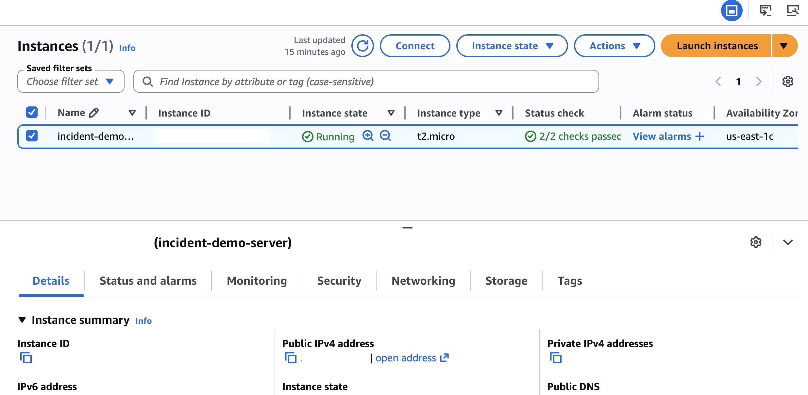
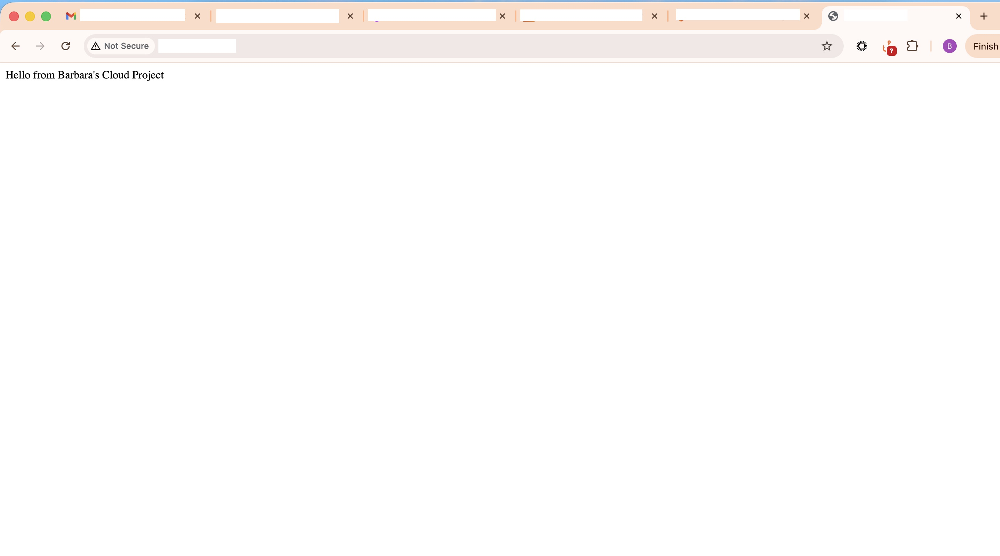
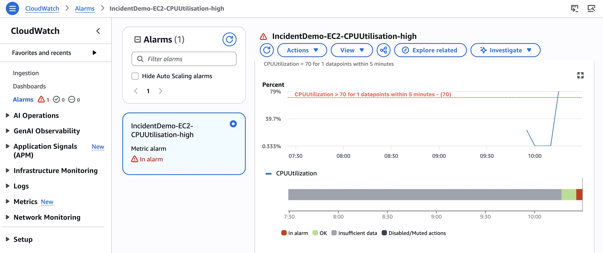

# AWS Incident Monitoring & Response System :cloud:

## Overview
This project demonstrates a real-world automated monitoring system. It uses AWS services to detect application downtime and trigger instant alerts, ensuring high availability and rapid incident response.

## :hammer_and_wrench: Tools & Services Used

**Compute:** AWS EC2 (Hosting the web application)
**Monitoring:** AWS CloudWatch (Alarms and Metrics)
**Security:** AWS IAM (Roles and Permissions)
**Notifications:** AWS SNS (Simple Notification Service)

## :building_construction: Architecture

**EC2 Instance:** Runs a Linux-based web server.
**CloudWatch Alarm:** Monitors the `StatusCheckFailed` metric of the instance.
**Trigger:** If the server goes down, the alarm changes to `ALARM` state.
**Alert:** A notification is sent to the administrator via email/SNS.

## :camera_with_flash: Screenshots

### 1. Infrastructure Setup
The EC2 instance is successfully provisioned and running the web server.

### 2. Live Application
The web application is accessible to users.

### 3. Incident Detection
CloudWatch successfully detects a simulated failure and triggers an alarm.

## :rocket: How to Replicate

Launch an EC2 instance with an Apache/Nginx server.
Create a CloudWatch Alarm for that instance.
Set the threshold for "Status Check Failed > 0".
Configure an SNS topic to email you when the state is in "ALARM".
